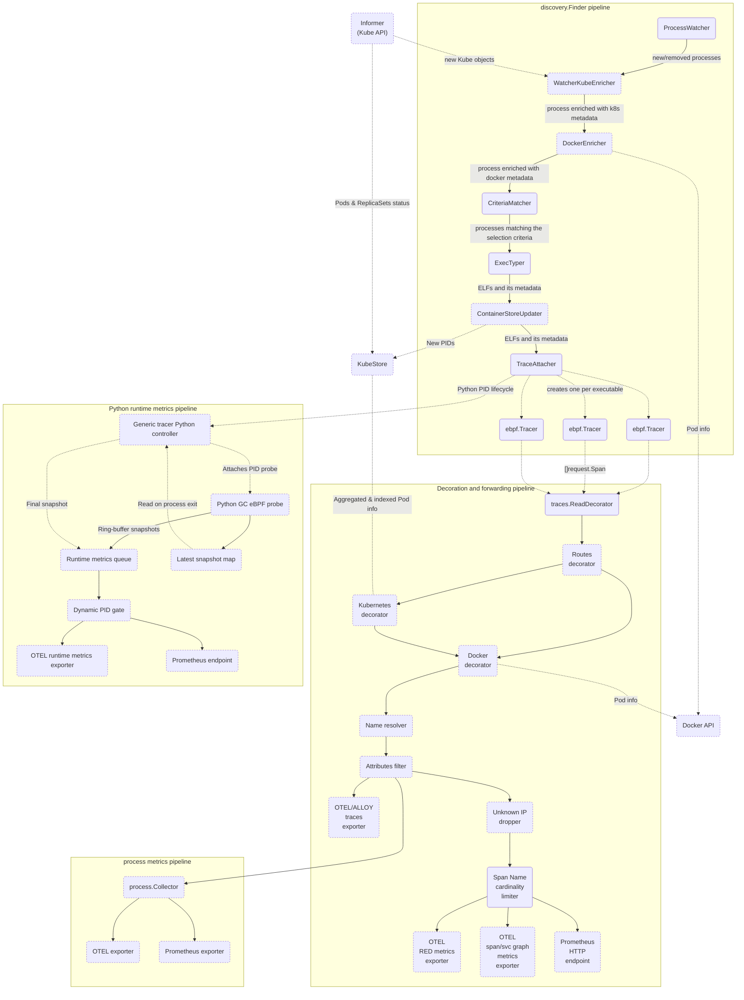
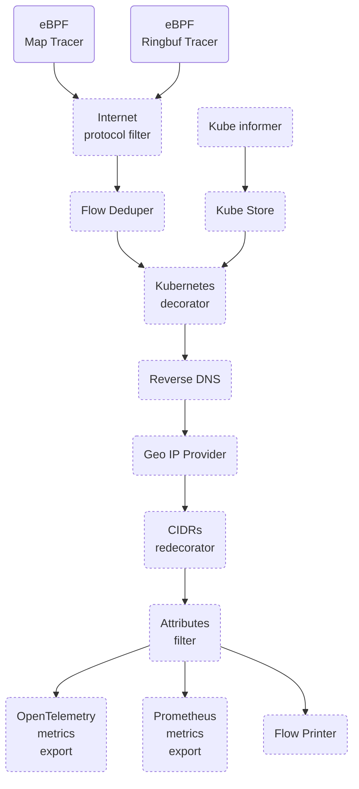
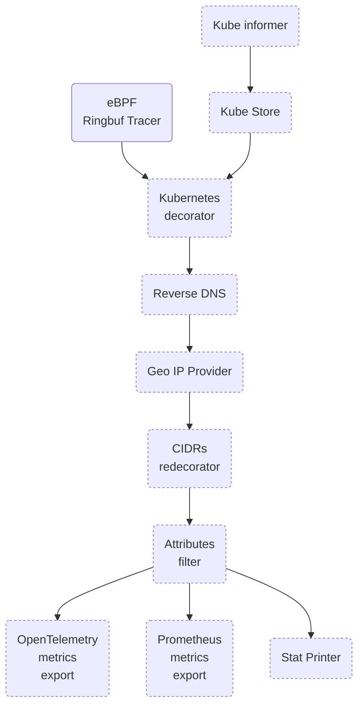
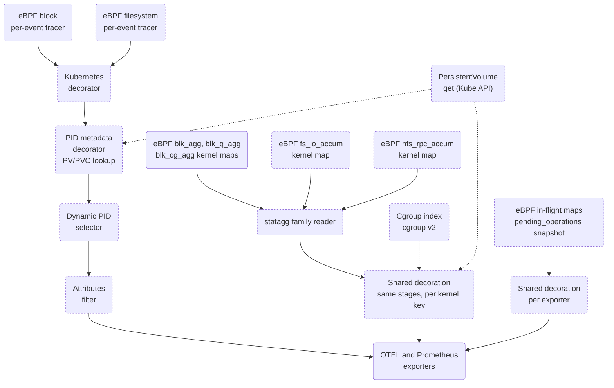

# OBI pipeline map

The whole OBI pipeline is divided in two main connected pipelines. The reason for not having a
single pipeline is that there are plans to split OBI into two: a finder/instrumenter executable
with high privileges and a reader/decorator executable with lesser privileges.

The dashed boxes are optional stages that will run only under certain conditions/configurations.

Check the in-code documentation for more information about each symbol.

## Table Of Contents

- [Application instrumentation pipeline](#application-instrumentation-pipeline)
- [Network metrics pipeline](#network-metrics-pipeline)
- [Stat metrics pipeline](#stat-metrics-pipeline)

## Application instrumentation pipeline

## Network metrics pipeline

## Stat metrics pipeline

### Storage metrics

Storage stats take one of two routes into the same OTEL and Prometheus exporters. Block, filesystem
and NFS metrics count in kernel maps by default and skip the per-event route: a `statagg` family
reads the maps and decorates each kernel key once (then again every 30 s), running the same stages
in the same order with the same `filters.stats` and dynamic PID selection, so both routes drop the
same series. With `ebpf.storage_aggregation.disabled` (or `stats.print_stats`), block and
filesystem metrics take the ring buffer route instead: each operation is an event and goes through
the pipeline above. `obi.stat.disk.pending_operations` takes neither: each exporter snapshots the
kernel's in-flight maps at collection and decorates the snapshot the same way.

